# Pokemon Go S2 Mapping Kildare

Draws cells, stops gyms and non-PoGo entities over an OpenStreetView  
Map to aid positioning and co-ordinating. Click here for the map:  


[Kildare Town Map](https://gsmitheidw.github.io/pogo-s2-kildare/)


### Features
- Pulls data from a csv file (not live updates and not relying on IITC/Ingress)
- Simple - only shows a grid for the town area
- Can run static from a local pc/phone, does not require a hosted webserver
- Tint cells (L17) to indicate if there is more than one point of interest per cell (none/green/orange/red)  
- Will zoom to your current GPS location
- Allows for categories of Points of Interst such as Gyms and PokéStops  
 but also Non-Pokémon Go (Ingres portal), Nominated and Potential
- Can be localised to any town or location (see below)

#### Marker Legends


| Marker Colour | Legend | Purpose   | Notes                                             |
| ------------- | ------ | --------- | ------------------------------------------------- |
| Blue          | 🔵     | PokéStop  | Regular Pokestops                                 |
| Red           | 🔴     | Gym       |                                                   | 
| Grey          | ❔     | Non-PoGo  | Approved nominations that do not show in the game |
| Purple        | 🟣     | Nominated | Items currently in queue or in voting in wayfarer |

**Non-pogo** - this is useful because a cell could be occupied by an item that only exists in Ingres,  
yet only 1 PokéStop can appear per Layer 17 cell. Or it could be that the nomination was approved
but simply was used in other Niantic games.

## Preview:


## Building your own copy locally:

- install python & pip
- install justfile
- clone this repo
- ensure python pip and modules listed are installed in your venv
- run ```just build``` or ```just rebuild```
- open index.html in a browser

## Localise for another town or city or village:

1. Edit the centre coordinates for your own locating changing these in the s2.py code:   

```python
center_lat = 53.1586  
center_lng = -6.9096  
```

2. Change the csv filename to your own list of stops and gym objects. Here's an example:  


```csv
name,lat,lng,type
Kildare Square,53.157004,-6.910557,Gym
"Leabharlann Cill Dara, Kildare Library",53.156641,-6.912269,PokéStop
"Kildare Derby Legends Trail Marker 8 of 12",53.155120,-6.911573,Nominated
```


3. Put the name of your csv file in s2.py replacing kildare_poi.csv  

4. Build by running python s2.py  (or using a justfile if you want to be snazzy)  


## Chart of S2 cells and Gym Trigger Logic:

```mermaid
flowchart TD
    %% === S2 Structure and Limits ===
    subgraph "🧱 S2 Cell Rules"
        A[🟡 L14 Cell<br/>~2.4km²<br/>Used for Gym eligibility logic. <br/>Contains 64 x L17 cells. Can have up to 3 Gyms, depending on the number of unique L17 cells with PokéStops.] --> B[🔵 L17 Cell<br/>~150m²<br/>Only one PokéStop or Gym allowed per L17 cell. This is the primary density limiter for in-game POIs. There are rare exceptions]
        B --> C[🟢 L20 Cell<br/>~12m²<br/>Used for wild spawns<br/>Max 1 spawn point per cell]
    end

    %% === Stop Distribution and L14 Calculation ===
    A --> D[🔍 Count PokéStops in this L14 cell]
    D --> E{📊 How many PokéStops<br/>in distinct L17 cells?}

    E -->|0-1| F[❌ No Gym created]
    E -->|2-5| G[✅ 1 Gym<br/>Top-ranked PokéStop]
    E -->|6-19| H[✅✅ 2 Gyms<br/>Top 2 ranked]
    E -->|20+| I[✅✅✅ 3 Gyms<br/>Top 3 ranked]

    %% === Notes ===
    subgraph "📝 Notes"
        N1[🔵 L17 limits PokéStop/Gym density<br/>Only one per L17 cell]
        N2[🟡 L14 determines gym conversion rules<br/>Up to 3 gyms per cell]
        N3[🟢 L20 governs wild Pokémon spawn eligibility<br/>Usually 1 spawn per cell; not all L20s used]
        N4[⭐ Top-ranked = Niantic's internal POI score<br/>Based on edits, scans, popularity]
    end
```




