# Pokemon Go S2 Mapping Kildare

Draws cells, stops gyms and non-PoGo entities over an OpenStreetView  
Map to aid positioning and co-ordinating.

### Features
- Pulls data from a csv file (not live updates and not relying on IITC/Ingress)
- Simple - only shows a grid for the town area
- Can run static from a local pc/phone, does not require a hosted webserver

## Preview:


## Building your own copy locally:

- install python & pip
- install justfile
- clone this repo
- run ```just build``` or ```just rebuild```
- open index.html in a browser

## Chart of S2 cells and Gym Trigger Logic

```mermaid
flowchart TD
    %% === S2 Structure and Limits ===
    subgraph "🧱 S2 Cell Rules"
        A[🟡 L14 Cell<br/>~2.4km²<br/>Used for Gym rules<br/>Contains ~64 L17 cells] --> B[🔵 L17 Cell<br/>~150m²<br/>Max 1 PokéStop or Gym per cell]
        B --> C[🟢 L20 Cell<br/>~12m²<br/>Used for wild spawns<br/>Max 1 spawn point per cell]
    end

    %% === Stop Distribution and L14 Calculation ===
    A --> D[🔍 Count PokéStops in this L14 cell]
    D --> E{📊 How many PokéStops<br/>in distinct L17 cells?}

    E -->|0-1| F[❌ No Gym created]
    E -->|2-5| G[✅ 1 Gym<br/>Top-ranked PokéStop]
    E -->|6-19| H[✅✅ 2 Gyms<br/>Top 2 ranked]
    E -->|20+| I[✅✅✅ 3 Gyms<br/>Top 3 ranked]

    
```

```mermaid
flowchart TD
    subgraph "📝 Notes"
        N1["🔵 L17: limits PokéStop/Gym density\nOnly one per L17 cell"]
        N2["🟡 L14: determines gym conversion rules\nUp to 3 gyms per cell"]
        N3["🟢 L20: governs wild spawn eligibility\nUsually 1 spawn per cell\nNot all L20s used"]
        N4["⭐ Top-ranked = Niantic's POI score\nBased on edits, scans, popularity"]
        N1 --> N2 --> N3 --> N4
    end
```







